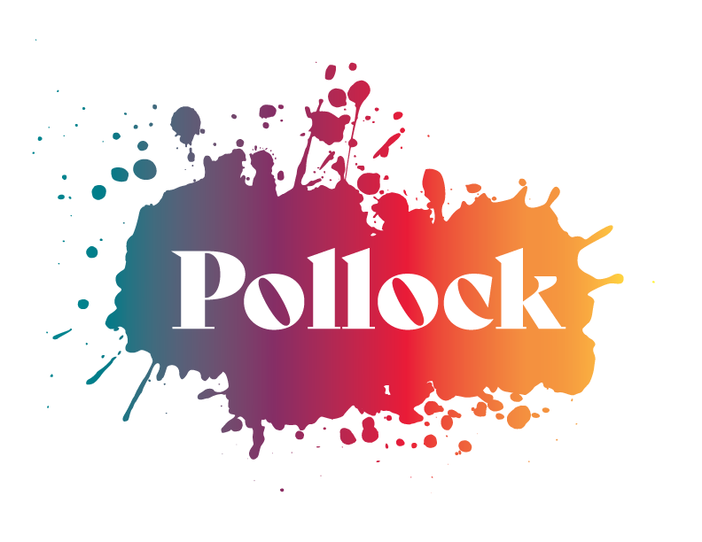

# Pollock

  

## Description

Pollock lets users create their own combinations of color palettes to save for reference. Features include authentication using bcrypt and sign in using session cookies. The front end interface is built using React with Hooks and Context for state management. The back end consists of a RESTful API built in Node/Express and a NoSQL database using MongoDB.

 

## Technologies

* Javascript
* React.js
* Node.js
* Express.js
* MongoDB
* Webpack

 

## Authors

* Abu Fofahnah [bubakarrr](https://github.com/bubakarrr)
* Daniel Balistocky [dannyb1983](https://github.com/dannyb1983)
* Jason Speare [jcspeare](https://github.com/jcspeare)
* Joshua Kim [jkim000](https://github.com/jkim000)
* Kim Spicer [justspicee](https://github.com/justspicee)

 

## License

[MIT](https://opensource.org/licenses/mit-license.php)

 
